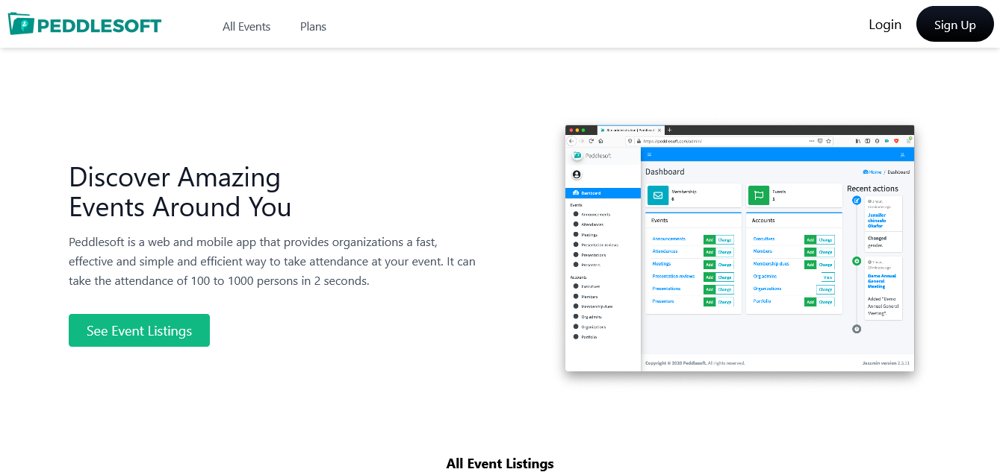
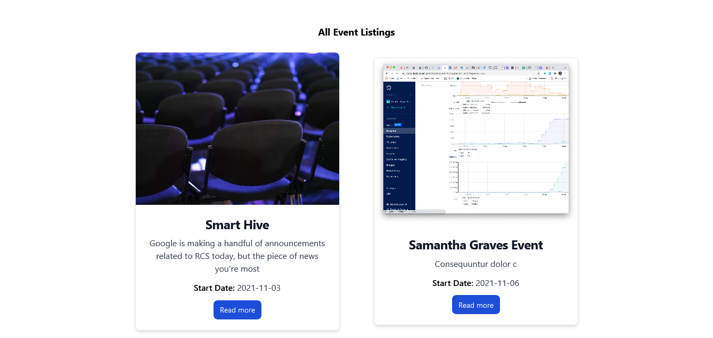
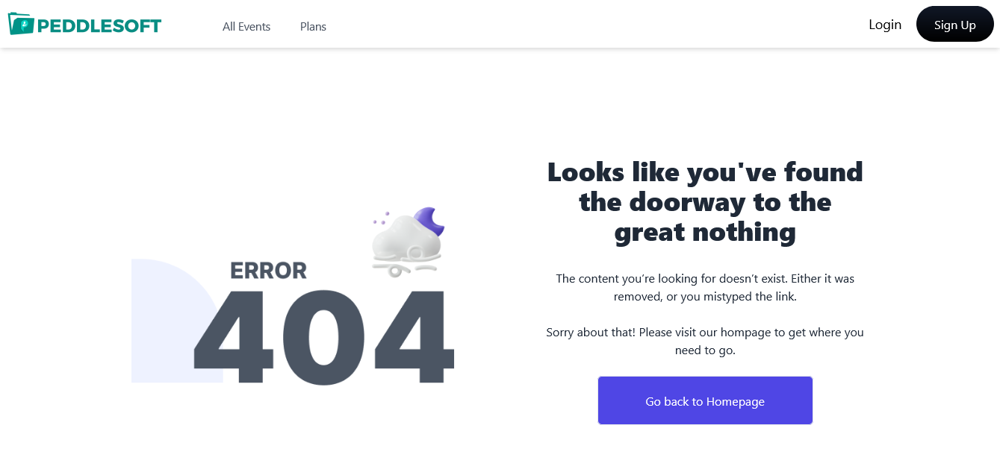

# Next.js + Tailwind CSS + GraphQl Event listing Website

## Preview

<span>



</span>

<hr />

Clone this repo :
`git clone https://github.com/AOMuiz/next-event`

Navigate to the root folder and install all dependencies :

- `yarn` or `npm install`

Start Development Mode :

- `yarn start` or `npm start`
- Open [http://localhost:3000](http://localhost:3000) to view it in the browser.
- Happy Hacking!

## A brief description of the project

### Task

> Build a Event Listing Website Using PeddleSoft Graphql API

> List all events.

> Each event with an Event Details Page

## Technologies Used

1. Used `Next Js` for building the website.

2. Implemented website styling using `Tailwind CSS`.

3. Used `Error Boundary` npm package for handling errors.

4. Used `Graphql & Apollo GraphQl` for data fecthing.

5. Created `Custom Hooks` for handling fetched data and rendering.

## Preview

Preview the example live on [StackBlitz](http://stackblitz.com/):

[](https://stackblitz.com/github/vercel/next.js/tree/canary/examples/with-tailwindcss)

## Deploy your own

Deploy the example using [Vercel](https://vercel.com?utm_source=github&utm_medium=readme&utm_campaign=next-example):

[](https://vercel.com/new/git/external?repository-url=https://github.com/vercel/next.js/tree/canary/examples/with-tailwindcss&project-name=with-tailwindcss&repository-name=with-tailwindcss)

## How to use

Execute [`create-next-app`](https://github.com/vercel/next.js/tree/canary/packages/create-next-app) with [npm](https://docs.npmjs.com/cli/init) or [Yarn](https://yarnpkg.com/lang/en/docs/cli/create/) to bootstrap the example:

```bash
npx create-next-app --example with-tailwindcss with-tailwindcss-app
# or
yarn create next-app --example with-tailwindcss with-tailwindcss-app
```

Deploy it to the cloud with [Vercel](https://vercel.com/new?utm_source=github&utm_medium=readme&utm_campaign=next-example) ([Documentation](https://nextjs.org/docs/deployment)).
